# Data Lovers
La educación de las mujeres en Brasil, Chile, México y Perú

Somos una empresa encargada de la manipulación y presentación de los indicadores que utiliza el Banco Mundial sobre el tema de la educación en América Latina para permitirle, a los interesados, la visualización de las condiciones en las que se encuentran, con el proposito de permitir el desarrollo de investigaciones o visalizar las áreas de oportunidad se necesitan que se fortalezcan.

Usuario: público interesado en temas de educación, desarrollo en América Latina, gobiernos, Organizaciones no gubernamentales.

Objetivo: con nuestra página se prentende facilitar la manipulación e interpretación de datos, para que el público interesado pueda emplearlos en la interpretación o como fuente para proyectos que busquen la solución de problemas.

## Resultado final
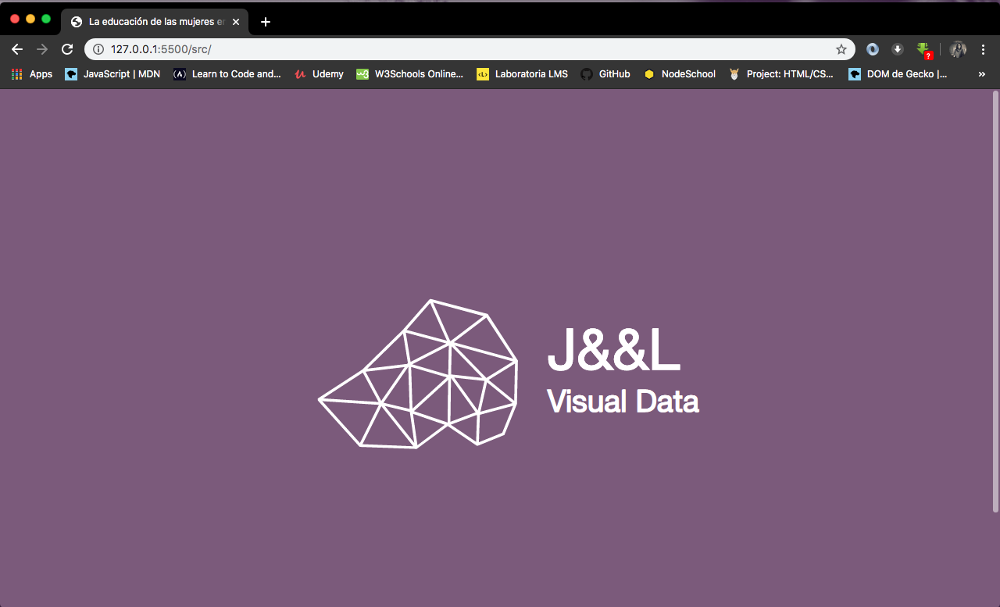
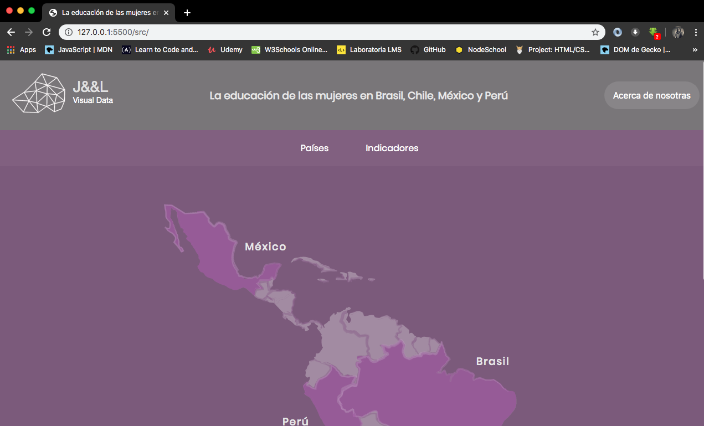
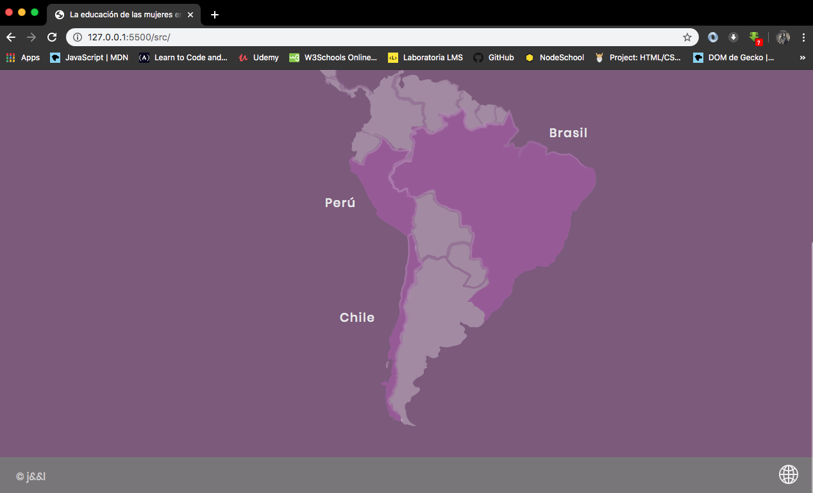

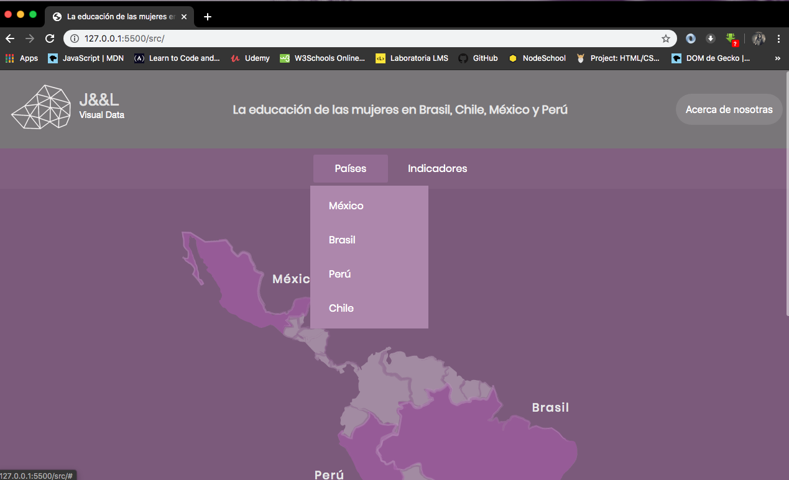
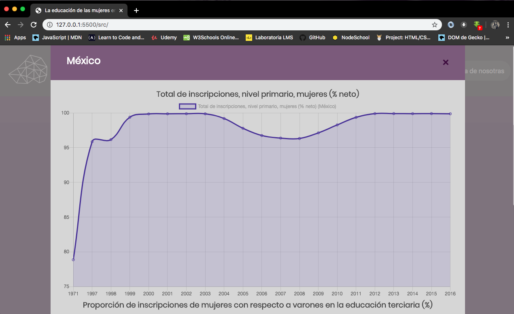

## Prototipo
Prototipo realizado en Adobe XD

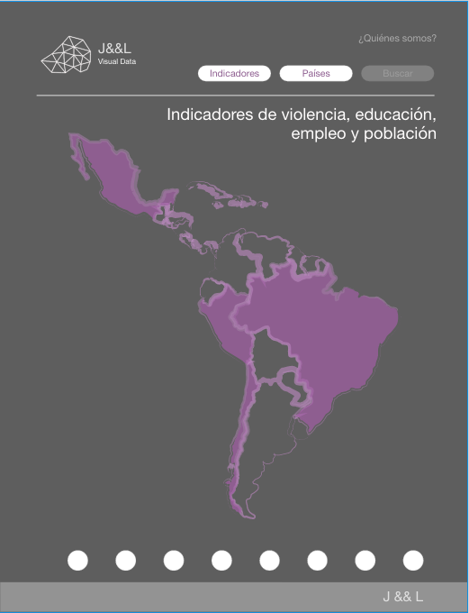
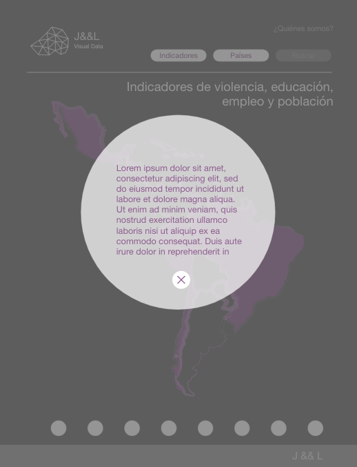
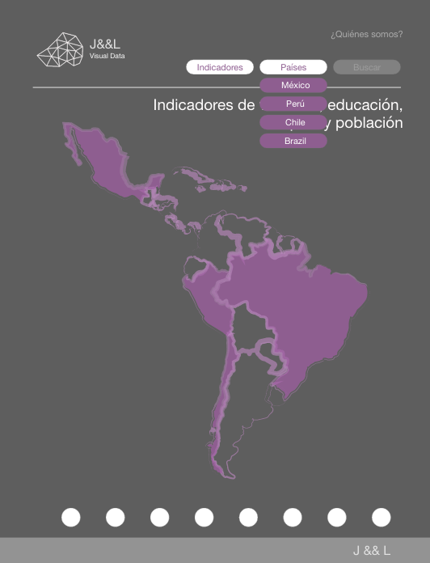
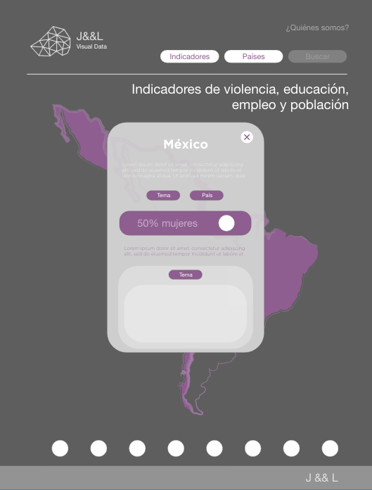
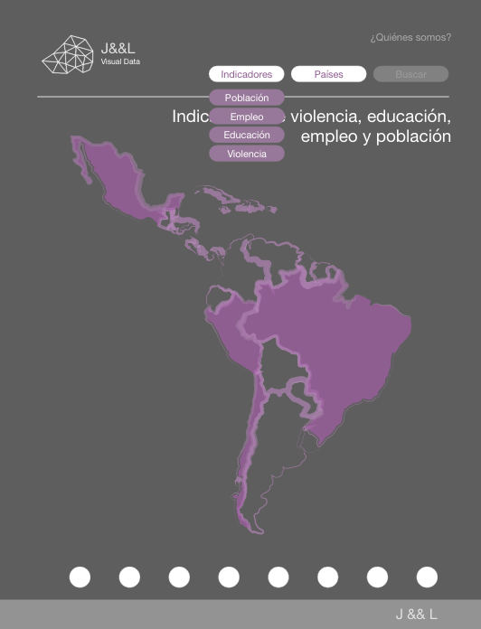
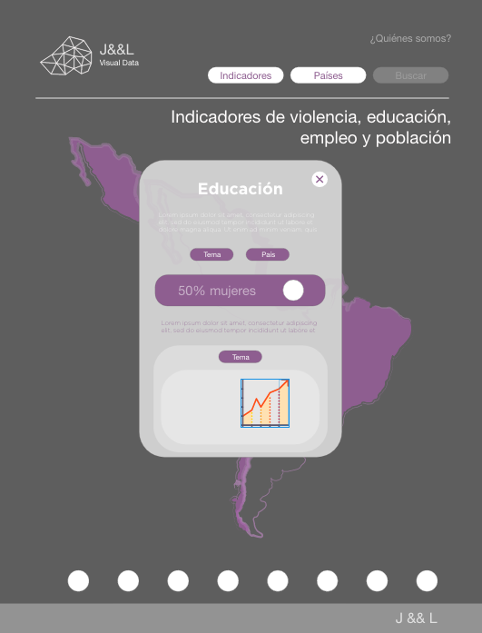

## Sketches
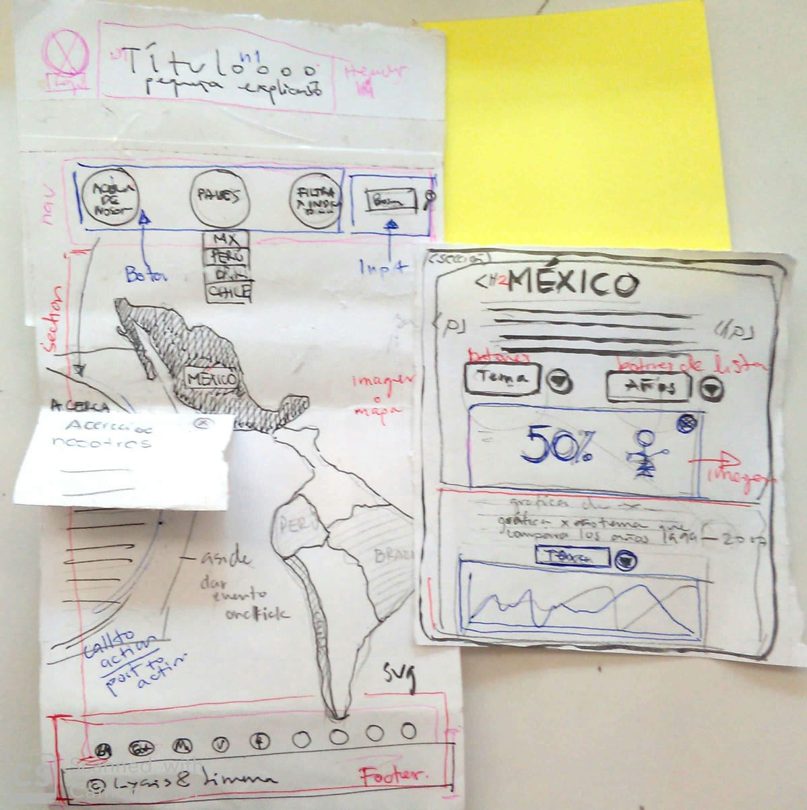

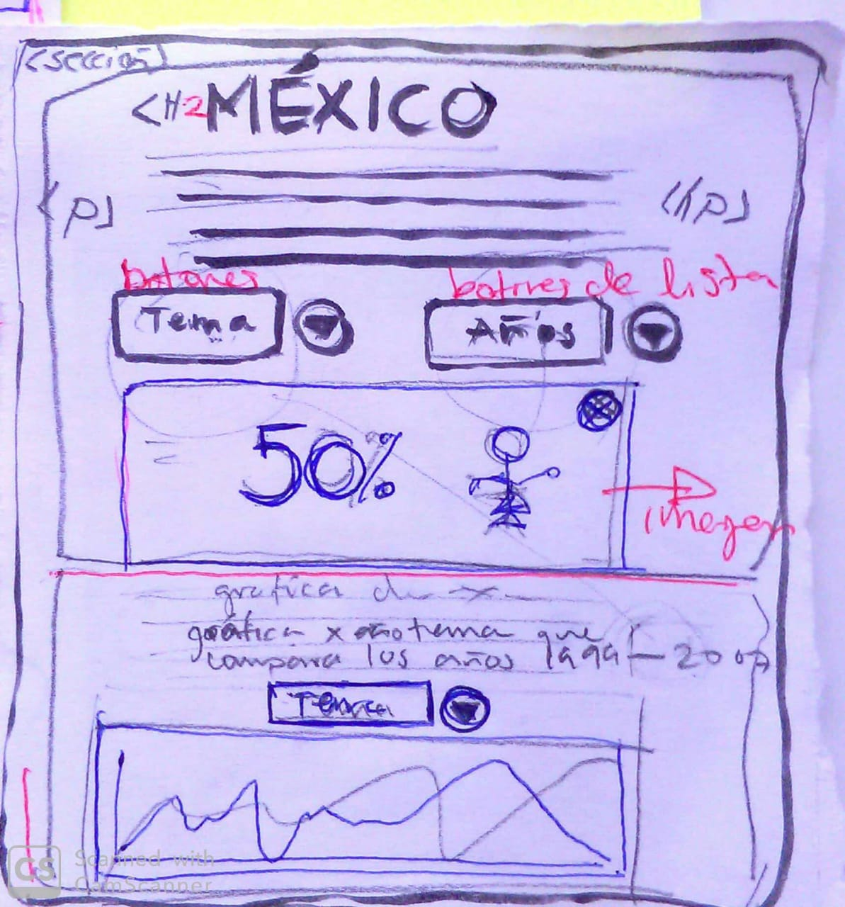
